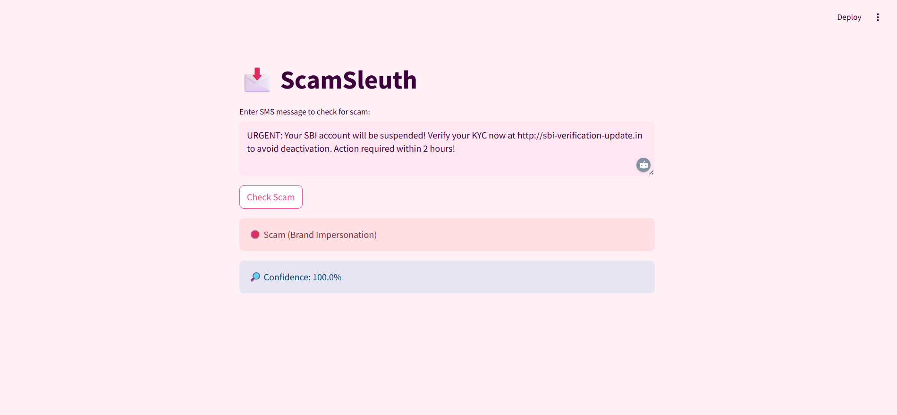

🕵️ ScamSleuth 💬 — SMS Scam Detector
ScamSleuth is a smart SMS scam and phishing detector that analyzes messages and URLs using machine learning and brand impersonation logic. From financial frauds to fake gaming rewards, ScamSleuth flags the bad stuff — so you don’t have to.

🔍 Features
1.  Detects scam messages using NLP models
2.  Identifies phishing URLs and brand impersonation
3.  EDA visualizations of message patterns
4.  Custom-trained ML models with confusion matrix
5.  Shows confidence scores 
6.  Clean and intuitive Streamlit interface

PROJECT STRUCTURE :
📁 ScamDetector/
├── Scamdetector_eda.ipynb     # Exploratory analysis of datasets
├── Scam Detection.ipynb       # ML training and confusion matrix
├── Models and preprocessing   # Saved models and preprocessing
├── ScamSleuth.py              # Streamlit UI code          
├── Datasets                   # Raw and cleaned datasets
├── README.md                  # You're here!

🧪 Datasets

1. Public SMS Spam Dataset Link-(https://raw.githubusercontent.com/justmarkham/pycon-2016-tutorial/master/data/sms.tsv)
2. List of urls classified benign, malware , phishing and defacement(DO NOT click on any link in this file)
3. Manually created well-known brands(prefered by scammers) and their official link

🚨 Scam Detection Workflow

Extract URLs from messages 🔗
Match with known brand domains 👔
If brand impersonation detected ➡️ auto-flag 🚩
If not, run ML model for scam likelihood 
Return label + confidence score 🎯

📸 Visualizations

Confusion matrix heatmap
Top phishing keywords bar chart
URL length distribution
Brand impersonation similarity plots

🚀 Try it Yourself

streamlit run ScamSleuth.py

🧑‍💻 Stack
Python, scikit-learn, pandas, matplotlib, Streamlit

🖼️ Streamlit Interface Preview

📬 Contributing
Ideas? Want to add more phishing phrases or brands? PRs welcome!

🛡️ Disclaimer
This tool is for educational use only. Always verify with official sources before taking action.

🧾 License
This project is licensed under the [MIT License](LICENSE).
 

